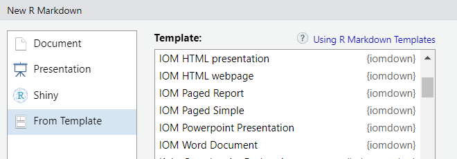

<!-- badges: start -->
<!-- badges: end -->

## Overview

The [International Organisation for Migration](http://iom.int) is part of the United Nations System. 

The organisation supports three main strategic objectives:   

  1. Saving lives and protecting people on the move,  
  
  2. Driving solutions to displacement,  
  
  3. Facilitating pathways for regular migration.  


The `{iomdown}` package provides a set of templates following [IOM Brand]() recommendations. 

The goal of this package is to ease and speed up the creation of reports, presentation and website while promoting the IOM visual identity.

## Installation

This package is not on yet on CRAN. To to install it, you will need the `{pak}` package.

``` r

install.packages("pak")
library(pak)

pak::pkg_install("iom/iomdown")
library(iomdown)

```

## Content

A package with all **necessary templates** to quickly create [IOM branded]( ) reproducible analysis:

Depending on the final output, create a new Rmd file and select on of the custom template that have been installed through the package.

To review some examples and user instructions, see: 

 * for presentation: [  [pptx](https://iom.github.io/iomdown/examples/skeleton.pptx) or [html](https://iom.github.io/iomdown/examples/html_slides.html)], 
 * for editable document: [[docx](https://iom.github.io/iomdown/examples/skeleton.docx)], 
 * for article: [[html](https://iom.github.io/iomdown/examples/html_page.html)],
 * for paginated-PDF-ready document: [[report](https://iom.github.io/iomdown/examples/paged_report.html) or shorter [note](https://iom.github.io/iomdown/examples/paged_simple.html)].
 
 We recommend starting with [report](https://iom.github.io/iomdown/examples/paged_report.html) that provide the most detailed descriptions.

## Usage

The `iomdown` templates are designed for R Markdown projects. 

To use the package document templates within **RStudio**:

**Step 1:** Click the “File” menu then “New File” and choose “R Markdown”.


**Step 2:** In the “From Template” tab, choose one of the built-in custom templates.




Alternatively, you can also use the `docx_simple`, `paged_report` or `paged_simple`, `pptx_slides`,
or `html_slides` engine in your existing R Markdown header.

For example:

``` yaml
---
title: "IOM Branded Rmarkdown"
author: First Last Name
date: "14 December, 2024"
output: iomdown::paged_report
---
```

## Getting help

Please report any issues or bugs on [GitHub issues](https://github.com/iom/iomdown/issues), try to include a minimal reproducible example to help us understand your problem.

## Contribute

Please note that the project is released with a [Contributor Code of Conduct](https://contributor-covenant.org/version/2/0/CODE_OF_CONDUCT.html).
By contributing to this project, you agree to abide by its terms.

To contribute with additional templates, do not hesitate to fork the repository and create a pull request. 

In order to create a new template, you can use:

``` r
usethis::use_rmarkdown_template(
  template_name = "Country_Factsheet",
  template_dir = NULL,
  template_description = "Key Statistical Facts for each Country",
  template_create_dir = TRUE
)

```
Then build the corresponding R functions with the R folder.

## License

This package is distributed under the [MIT License](https://github.com/iom/iomthemes/blob/master/LICENSE.md).
